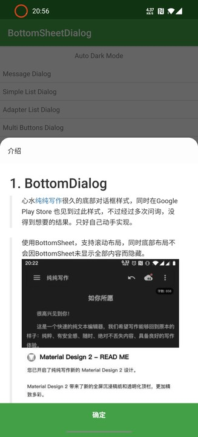

[](https://jitpack.io/#Vove7/BottomDialog)

# BottomDialog

> 心水[纯纯写作](https://www.coolapk.com/apk/com.drakeet.purewriter)很久的底部对话框样式，同时在Google Play Store 也见到过此样式，不过经过多次问询，没得到想要的结果。只好自己动手实现。

> 使用BottomSheet，支持滚动布局，同时底部布局不会因BottomSheet未显示全部内容而隐藏。



### 目录

- [特性](#特性)
- [DEMO](#DEMO)
  - [简单标题文字](#简单标题文字)
  - [简单列表](#简单列表)
  - [自定义列表](#自定义列表)
- [扩展](#扩展)
- [引入BottomDialog](#引入BottomDialog)
- [自定义布局构造器](#自定义布局构造器)
  - [1. 三层布局构造器](#1.-定义三层布局构造器)
  - [2. 设置扩展函数](#2.-设置扩展函数)
  - [3. 自定义列表内容布局](#3.-自定义列表内容布局)
- [Faqs](#Faqs)
  - [1. show()过后如何更新布局？](#1.-show()过后如何更新布局？)
  - [2. 属性委托相关](#2.-属性委托相关)
- [实现原理](#实现原理)

### 特性

- 高度自定义

    支持自定义头部布局(Toolbar...)、内容布局(列表、文字)和底部布局(按钮、BottomAppBar)


- 底部布局自适应导航栏

    只在类原生机器测试过，不保证支持国产定制系统

- 支持Activity形式的Dialog(BottomDialogActivity)

    有Context即可显示的对话框

- 列表可操作list进行更新View

    支持监听List

### DEMO

#### 简单标题文字


```kotlin
 BottomDialog.builder(this) {
     title("Hello")
     message(
             buildString {
                 for (i in 0..30) {
                     for (j in 0..i * 5) append(j)
                     appendln()
                 }
             }, true
     )
     oneButton("OK", autoDismiss = true) {
         //长按，更新内容布局
         onLongClick { dialog ->
             dialog.updateContent<MessageContentBuilder> {
                 text = Random().nextDouble().toString()
             }
         }
     }
 }
```

#### 简单列表


```kotlin
val list = ObservableList.build<String?> {
    for (i in 0..50) add("item $i")
    add("到底了")
}
BottomDialog.builder(this) {
    this.title("Hello")
    mutableList(list) { _, position, s, l ->
        toast("clicked $s at $position longClick: $l")
    }
    buttons {
        negativeButton()
        neutralButton("removeAt(0)") {
            if (list.isNotEmpty()) list.removeAt(0)
        }
        positiveButton("add(0, '...')") {
            list.add(0, "...")
        }
    }
}
```

#### 自定义列表

加载应用列表，AppListBuilder 见下文自定义布局构造器


```kotlin
 BottomDialog.builder(this) {
     title("应用列表")
     content(AppListBuilder(this@MainActivity) { _, p, i, l ->
         toast("$p\n$i\n$l")
     })
     oneButton("取消")
 }
```


### 扩展

实现的更多的ContentBuilder

[详见模块Extension](extension/ReadMe.md)

- 仿一加系统分享对话框效果
[AwesomeHeader]


### 引入BottomDialog

1. 在工程`build.gradle`添加  
```groovy
allprojects {
    repositories {
        //...
        maven { url 'https://jitpack.io' }
    }
}
```

2. 添加依赖

最新版本：
[](https://jitpack.io/#Vove7/BottomDialog)

- BottomDialog

```groovy
dependencies {
	implementation 'com.github.Vove7.BottomDialog:bottomdialog:2.1'
	
	//android x 使用依赖：
	implementation 'com.github.Vove7.BottomDialog:bottomdialog:2.1-x'
}
```

- 扩展包(可选)

```groovy
dependencies {
	implementation 'com.github.Vove7.BottomDialog:extension:2.1'
	
	//android x 使用依赖：
	implementation 'com.github.Vove7.BottomDialog:extension:2.1-x'
}
```

### 自定义布局构造器

#### 1. 定义三层布局构造器

三层布局均可继承`ContentBuilder`

如 `ToolbarHeader`，其中`title`属性被`listenToUpdate`委托，在修改时，会通知`updateContent`进行更新布局。

```kotlin
class ToolbarHeader(title: CharSequence?) : ContentBuilder() {
    /**
     * 指定更新type = 1
     */
    var title by listenToUpdate(title, this, type = 1)

    /**
     * 导航栏图标 type = 2
     */
    var navIconId: Int? by listenToUpdate(null, this, type = 2)

    /**
     * 导航图标点击事件 type = 3
     */
    var onIconClick: OnClick? by listenToUpdate(null, this, type = 3)

    override val layoutRes: Int = R.layout.header_toolbar

    lateinit var toolBar: Toolbar

    /**
     * 初始化View
     * @param view View
     */
    override fun init(view: View) {
        toolBar = view.tool_bar
    }

    /**
     * 进行视图更新
     * @param type Int listenToUpdate中指定的type，初始化时type值为-1
     * 可根据type值来选择更新视图，而不是全部更新
     * @param data Any? 传递值
     */
    override fun updateContent(type: Int, data: Any?) {
        //type 为1 时，属性 title 被修改
        if (type == -1 || type == 1) toolBar.title = title
        
        if (type == -1 || type == 2)
            navIconId?.also {
                toolBar.setNavigationIcon(it)
            } ?: toolBar.setNavigationIcon(null)
        
        if (type == -1 || type == 3) {
            toolBar.setNavigationOnClickListener {
                onIconClick?.invoke(dialog)
            }
        }
    }
}
```

#### 2. 设置扩展函数

**此操作可选**，目的是为了方便在builder函数中调用。

已扩展的函数有：
```kotlin

//设置标题
fun BottomDialogBuilder.title(title: CharSequence?): BottomDialogBuilder

//设置内容
fun BottomDialogBuilder.message(
    text: String, 
    selectable: Boolean = false
): BottomDialogBuilder

//简单列表
fun BottomDialogBuilder.simpleList(
    items: List<String?>, 
    autoDismiss: Boolean = true, 
    onItemClick: OnItemClick<String?>
): BottomDialogBuilder

/**
 * 三个按钮布局
 * buttonPositive
 * buttonNegative
 * buttonNeutral
 */
fun BottomDialogBuilder.buttons(block: ButtonsBuilder.() -> Unit): BottomDialogBuilder

//........ 更多参考Class: [BottomDialogBuilder]
```

如扩展`BottomDialogBuilder`一个toolbar函数:

```kotlin
/**
 * 头部使用Toolbar
 */
fun BottomDialogBuilder.toolbar(action: ToolbarHeader.() -> Unit): BottomDialogBuilder {
    headerBuilder = ToolbarHeader().apply(action)
    return this
}
```

使用：
```kotlin
BottomDialog.builder(this, show = true) {
    toolbar {
        title = "Hello"
        navIconId = R.mipmap.ic_launcher
        onIconClick = {
            dialog.dismiss()
        }
    }
}
```
除了设置扩展函数，还可直接指定`header`(其他两种布局亦可，`content, footer`):
```kotlin
BottomDialog.builder(this) {
    header(ToolbarHeader()) {
        //...
    }
}
```

#### 3. 自定义列表内容布局

可继承`ListAdapterBuilder`快速实现。

> 可指定`layoutManager`

> 泛型`T` 可实现`Typeable` 区分元素类别，以构建不同样式

如 应用列表内容构造器 `AppListBuilder`


```kotlin
class AppListBuilder(
        context: Context,
        autoDismiss: Boolean = true,
        private val appList: ObservableList<AppInfo> = ObservableList(),
        onItemClick: OnItemClick<AppInfo>

) : ListAdapterBuilder<AppInfo>(applist, autoDismiss, onItemClick) {

    init {
        loading = true //加载视图
        thread {
            sleep(1500)
            loadAppList(context)
        }
    }
    //type 为元素类型，若items 未继承 Typeable: type = 0
    override val itemView: (type: Int) -> Int = { R.layout.item_app_list }

    //item 绑定到视图
    override val bindView: BindView<AppInfo> = { view, item ->
        view.text_1.text = item.name
        view.text_2.text = item.pkg
    }

    private fun loadAppList(context: Context) {
        val pm = context.packageManager
        appList.addAll(ObservableList.build {
            pm.getInstalledPackages(0)?.forEach {
                add(AppInfo(it.packageName, it.applicationInfo.loadLabel(pm)))
            }
        })
        
        //停止加载
        loading = false
    }
}

data class AppInfo(
        val pkg: String,
        val name: CharSequence
)

```

使用：
```kotlin
BottomDialog.builder(this) {
    title("应用列表")
    
    //指定内容布局Builder
    content(AppListBuilder(this@MainActivity) { _, p, i, l ->
        toast("$p\n$i\n$l")
    })
    
    oneButton("取消")
}
```


### Faqs

#### 1. show()过后如何更新布局？

此时比如更新message内容(内容布局类型为MessageContentBuilder)

```kotlin
dialog.updateContent<MessageContentBuilder> {
    //text 属性被委托，才可通知布局刷新，见[MessageContentBuilder]
    text = "new message"
}
```

#### 2. 属性委托相关

当属性被委托后，改变值即可通知`ContentBuilder`的`updateContent(type: Int, data: Any?)`

如:
```kotlin
var title by listenToUpdate(title, this, 2)
```
当title值被修改后，会执行updateContent(2)

### 实现原理

1. 列表类型为`ObservableList`，可监听内容变化，来通知Adapter更新布局

2. 对话框底部布局，能够悬浮，由于：其中BottomSheet布局`bs_root`与`footer_lay`同级。

布局文件`dialog_content.xml`。（已去除不重要属性）

```xml
<CoordinatorLayout>

    <!--BottomSheet-->
    <LinearLayout
        android:id="@+id/bs_root"
        app:layout_behavior="android.support.design.widget.BottomSheetBehavior">

        <!--头部布局-->
        <FrameLayout android:id="@+id/header_container" />


        <NestedScrollView android:id="@+id/container">
            
            <!--内容布局-->
            <FrameLayout android:id="@+id/content"/>
        </NestedScrollView>
    </LinearLayout>

    <LinearLayout
        android:id="@+id/footer_lay"
        android:layout_alignParentBottom="true"
        android:layout_gravity="bottom" >
        <!--底部布局-->
        <FrameLayout android:id="@+id/footer_contains" />
        <!--用于撑起底部布局于导航栏之上-->
        <View android:id="@+id/fill_nav" />
    </LinearLayout>

</CoordinatorLayout>
```

详细内容请参考源码
